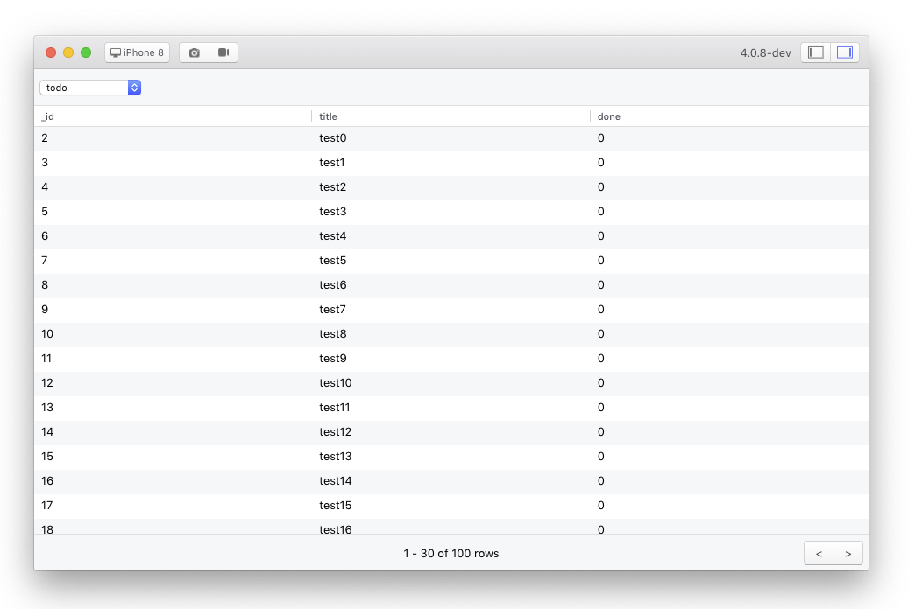

# Database

Easily browse the app's local database.



## Quick start

### Initialization

To use the database plugin, you need to add the plugin to your `FlipperClient` instance.

```dart
import 'package:flutter_flipperkit/flutter_flipperkit.dart';

void main() {
  FlipperClient flipperClient = FlipperClient.getDefault();

  var databaseDriver = SqfliteDriver('simple_todo.db'); // 示例使用了 Sqflite
  flipperClient.addPlugin(new FlipperDatabaseBrowserPlugin(databaseDriver));
  flipperClient.start();

  runApp(MyApp());
}
```

### Enable Inspection

for [sqfite](https://github.com/tekartik/sqflite), you can use [flipperkit_sqflite_driver](https://github.com/blankapp/flutter_flipperkit_plugins/tree/master/packages/flipperkit_sqflite_driver) driver:

```dart
var sqfliteDriver = SqfliteDriver('simple_todo.db');
flipperClient.addPlugin(new FlipperDatabaseBrowserPlugin(sqfliteDriver));
```

## Related Links

- https://github.com/tekartik/sqflite
- https://github.com/blankapp/flipper-plugin-dbbrowser